# Procesverslag
Markdown is een simpele manier om HTML te schrijven.  
Markdown cheat cheet: [Hulp bij het schrijven van Markdown](https://github.com/adam-p/markdown-here/wiki/Markdown-Cheatsheet).

Nb. De standaardstructuur en de spartaanse opmaak van de README.md zijn helemaal prima. Het gaat om de inhoud van je procesverslag. Besteedt de tijd voor pracht en praal aan je website.

Nb. Door *open* toe te voegen aan een *details* element kun je deze standaard open zetten. Fijn om dat steeds voor de relevante stuk(ken) te doen.

## Jij

  
uitwerken voor kick-off werkgroep

  ### Auteur:
  Dylan Abrahams

  #### Je startniveau:
  Rood

  #### Je focus:
  Responsive plane
 

## Je website

  
uitwerken voor kick-off werkgroep

  ### Je opdracht:
  rightourstory.com

  #### Screenshot(s) van de eerste pagina (small screen): 
  Home

  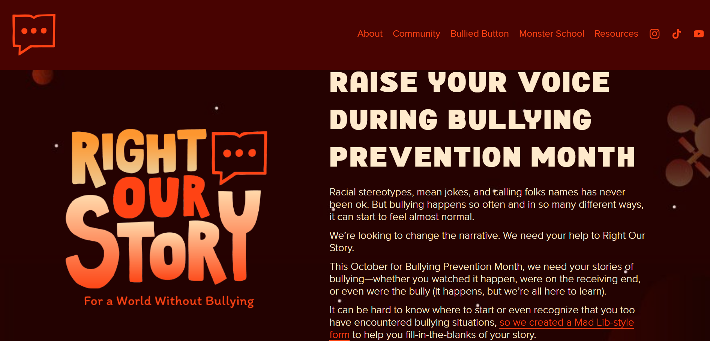

  #### Screenshot(s) van de tweede pagina (small screen):
  Bullied Button

  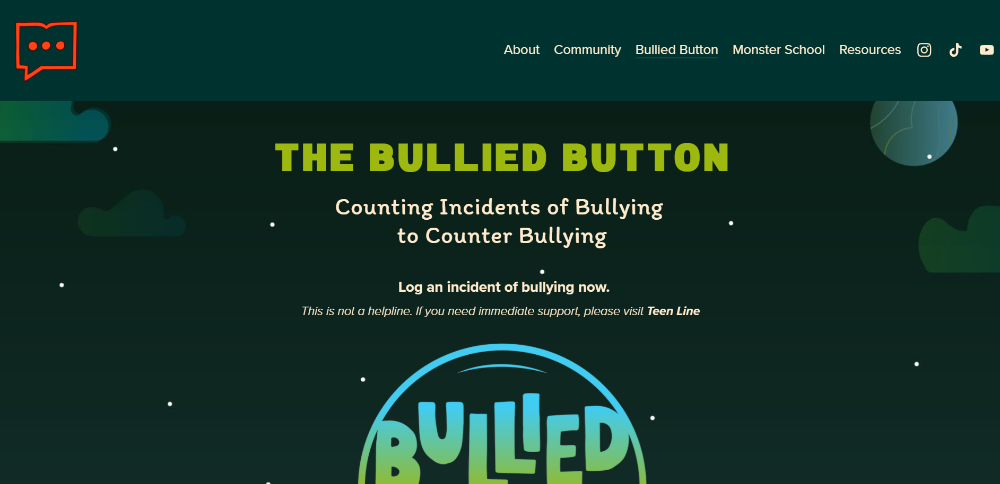
 

## Toegankelijkheidstest 1/2 (week 1)

  
uitwerken na test in 2e werkgroep

  ### Bevindingen
  Lijst met je bevindingen die in de test naar voren kwamen:
  - HTML is niet gevalidate
  - Focus werkte, maar alleen op windows
  - Er was weinig gebruik gemaakt van ul li's
  - Afbeeldingen hadden geen alt
  - Ik moet afbeeldingen met tekst, de tekst in de alt zetten
  - Animatie moet op pauze gezet kunnen worden
  - Media mag niet vanzelf afspelen
  - Er is geen button element gebruikt
  - Er is geen skip link
  - Dark mode wordt niet gesupport
  - Grote tekst wordt niet gesupport
  - Kleurcontrast klopt

## Breakdownschets (week 1)

  
uitwerken na afloop 3e werkgroep

  ### de hele pagina: 
  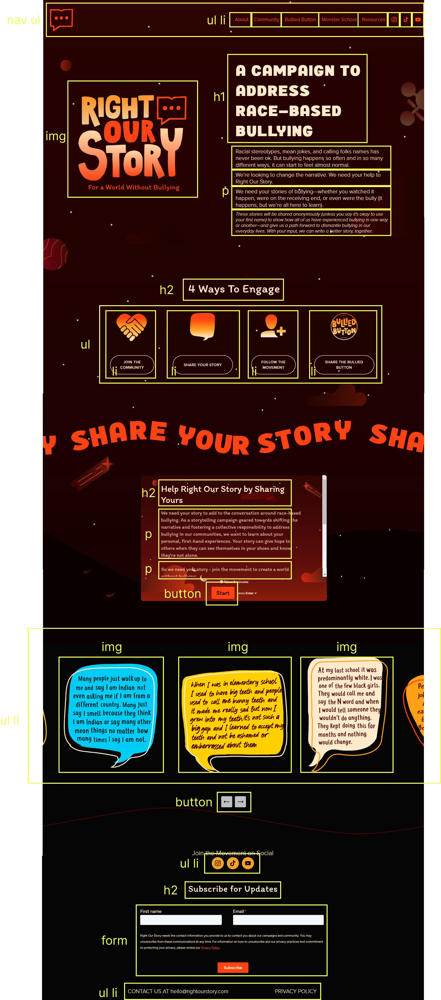

## Voortgang 1 (week 2)

  
uitwerken voor 1e voortgang

  ### Stand van zaken
  hier dit ging goed & dit was lastig (neem ook screenshots op van delen van je website en code)

  - Ik loop lekker op schema
  - Ik heb niet echt vragen voor de meeting, maar ik denk dat ik ter plekke wel vragen zal hebben.

  ### Agenda voor meeting
  samen met je groepje opstellen

  | student 1      | student 2          | student 3    | student 4        |
  | ---            | ---                | ---          | ---              |
  | dit bespreken  | en dit             | en ik dit    | en dan ik dat    |
  | en dat ook nog | dit als er tijd is | nog een punt | dit wil ik zeker |
  | ...            | ...                | ...          | ...              |

  ### Verslag van meeting
  hier na afloop snel de uitkomsten van de meeting vastleggen
  - Ik moet een aantal sections veranderen naar divs
  - Ik heb voor mijn afbeeldingen lijst een caroucel nodig
  - Mijn CSS ziet er goed uit
  - Mijn HTML is ook goed qua ul li's, headings enz..
  - Je mag (of moet eigenlijk) meerdere stylepaginas gebruiken

## Voortgang 2 (week 3)

  
uitwerken voor 2e voortgang

  ### Stand van zaken
  hier dit ging goed & dit was lastig (neem ook screenshots op van delen van je website en code)

  - Ik heb mijn homepagina zo goed als af
  - De navigatie werkt op mobiel
  - Ik heb nog maar 1 style pagina, die moet ik opdelen in 2
  - Alles lijkt me (hoe ik het nu zie) duidelijk wat ik moet doen
  - Ik moet nog de tweede pagina doen

  ### Agenda voor meeting
  samen met je groepje opstellen

  | student 1      | student 2          | student 3    | student 4        |
  | ---            | ---                | ---          | ---              |
  | dit bespreken  | en dit             | en ik dit    | en dan ik dat    |
  | en dat ook nog | dit als er tijd is | nog een punt | dit wil ik zeker |
  | ...            | ...                | ...          | ...              |

  ### Verslag van meeting
  hier na afloop snel de uitkomsten van de meeting vastleggen

  - Ik was niet aan de beurt geweest
  - Deze meeting was met Sanne, er werden veel voorbeelden laten zien,
  - Ik moet mijn pixels naar ems veranderen
  - Ik moet meer percentages gebruiken voor width
  - ik moet gap gebruiken bij flexbox in plaats van margin/padding

## Toegankelijkheidstest 2/2 (week 4)

  
uitwerken na test in 9e werkgroep

  ### Bevindingen
  Lijst met je bevindingen die in de test naar voren kwamen (geef ook aan wat er verbeterd is):
  - Mijn site is goedgekeurd door de HTML validator
  - De focus states werken, ik moet alleen een border toevoegen zodat het ook buiten windows werkt
  - Mijn site werkt niet goed op mobiel horizontaal
  - Ik heb nu wel ul li's
  - Al mijn afbeeldingen hebben nu een alt, waaronder de afbeeldingen met tekst
  - Mijn tweede pagina heeft voor de bullied button een pauze knop nodig
  - Ik heb geen skip link
  - Ik heb light en dark mode voor de homepagina, ik heb de achtergrond image eruit gehaald

## Voortgang 3 (week 4)

  
uitwerken voor 3e voortgang

  ### Stand van zaken
  hier dit ging goed & dit was lastig (neem ook screenshots op van delen van je website en code)
  - Ik heb allebei mijn pagina's (nog niet helemaal af)
  - Ik heb 3 style paginas
  - Mijn header veranderd tijdens het scrollen
  - Ik wil graag zeker weten of mijn code er goed uitziet (semantisch correct!)

  ### Agenda voor meeting
  samen met je groepje opstellen

  | student 1      | student 2          | student 3    | student 4        |
  | ---            | ---                | ---          | ---              |
  | dit bespreken  | en dit             | en ik dit    | en dan ik dat    |
  | en dat ook nog | dit als er tijd is | nog een punt | dit wil ik zeker |
  | ...            | ...                | ...          | ...              |

  ### Verslag van meeting
  hier na afloop snel de uitkomsten van de meeting vastleggen

  - Mijn code is goedgekeurd
  - Ik had niet echt veel vragen, ik wilde eerder weten of alles wat ik had er goed uitzag.

## Eindgesprek (week 5)

  
uitwerken voor eindgesprek

  ### Je uitkomst - karakteristiek screenshots:
  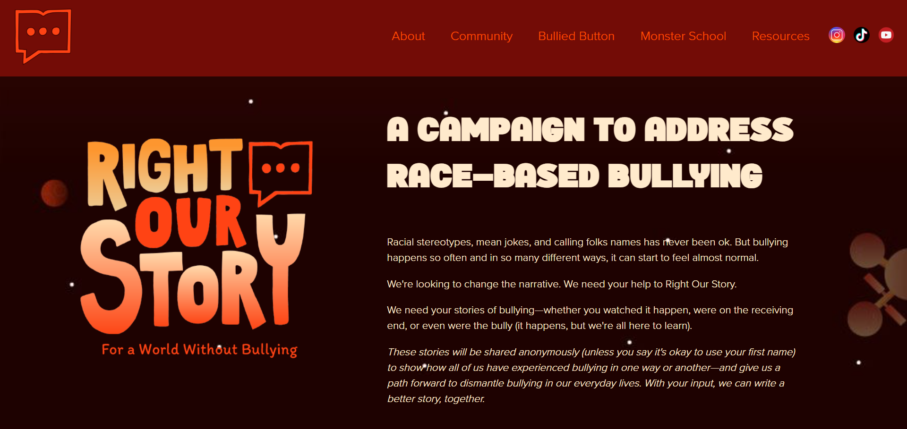
  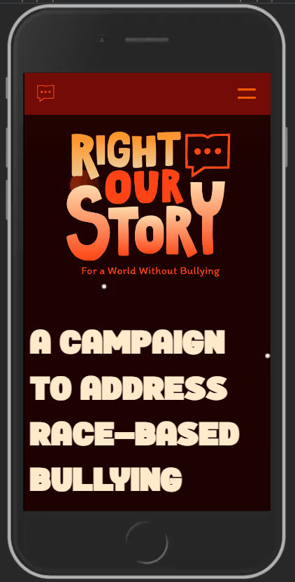
  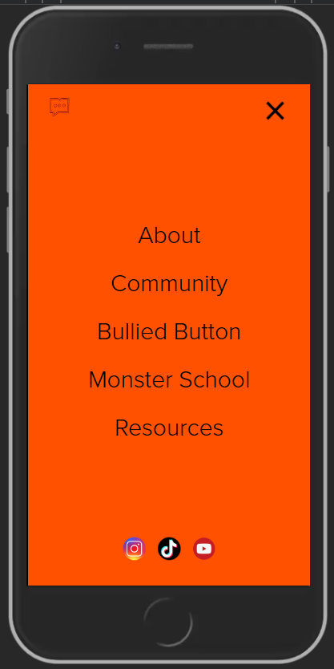
  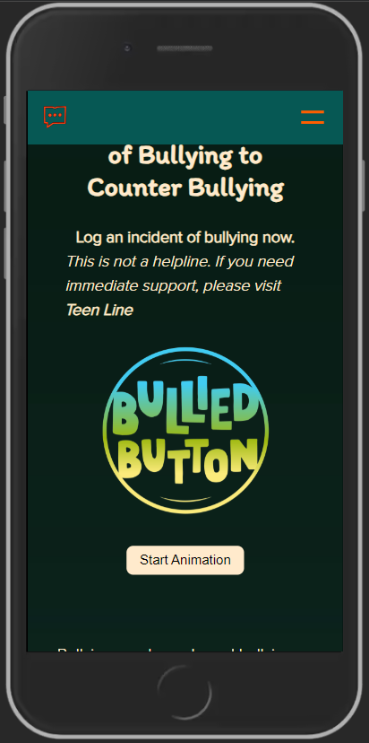
  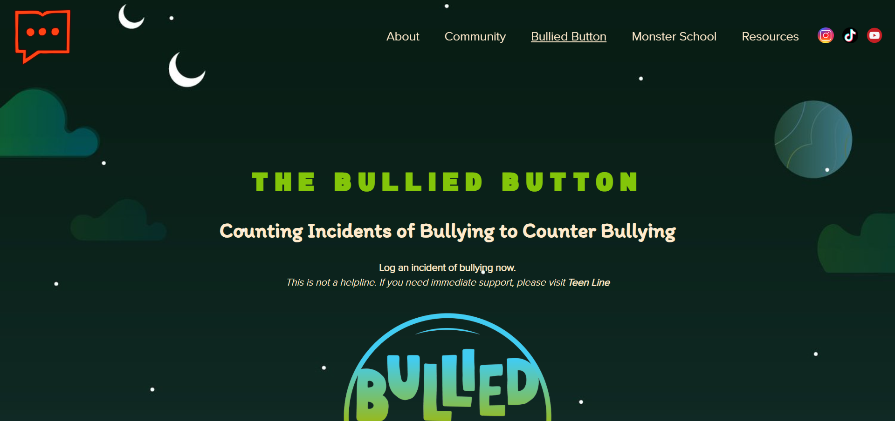

  ### Dit ging goed/Heb ik geleerd: 
  - Ik heb heel veel flexbox gebruikt, ik heb dus daar nu heel veel inzicht/gevoel voor
  - Ik weet hoe ik animaties kan maken, helaas had mijn websites niet heel veel
  - Ik weet hoe ik de navigatie werkend kan maken voor mobiel dmv hamburgermenu
  - Ik snap @media
  - 

  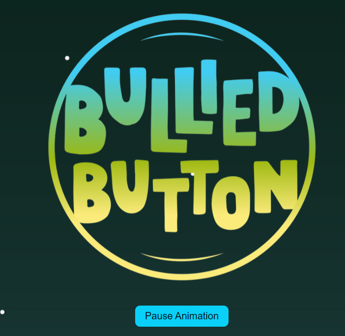
  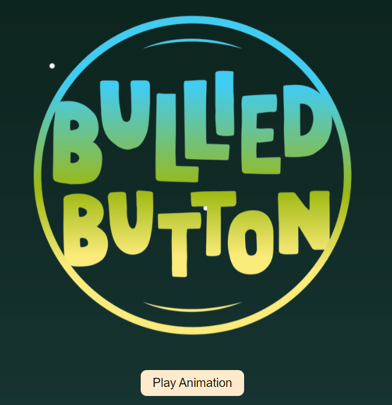
  

  ### Dit was lastig/Is niet gelukt:
  - Ik heb geen caroucel gemaakt
  - Ik heb mijn site op mobiel en desktop werkend gemaakt, maar hij is niet helemaal responsive
  - Ik had vaak eerst desktop, dan mobiel gedaan. Achteraf was het beter om andersom te doen..

  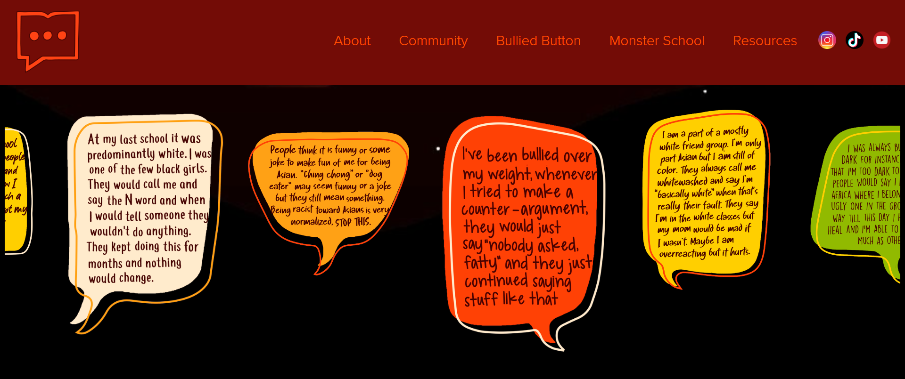

## Feedback Eindgesprek

  
Wat ik moet aanpassen

  ###   Dit moet ik nog allemaal doen
  - README aanvullen met plaatjes en meer uitwerken

  - Eerste div in homepagina aanpassen naar een section met daarin een div
  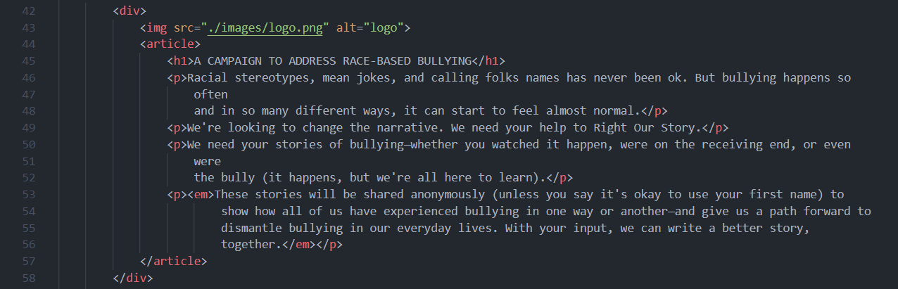

  - Het scrollbare article veranderen naar section en deze beter uitwerken
  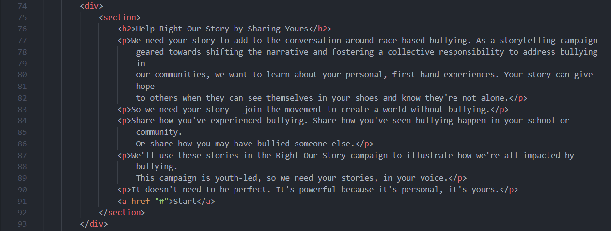

  - Site meer responsive maken, iets meer media queries

  - Light mode uitwerken
  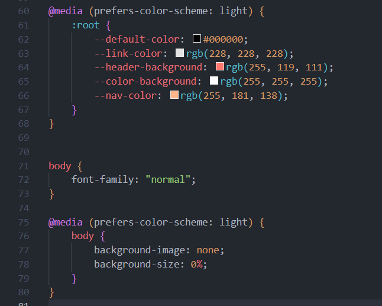

  - Een h2 in alle sections, een onzichtbare h2 nog steeds laten lezen door screenreader

  - Focus state verbeteren, het is nu een border ipv shadow
  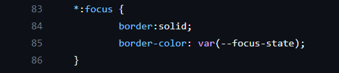
  
  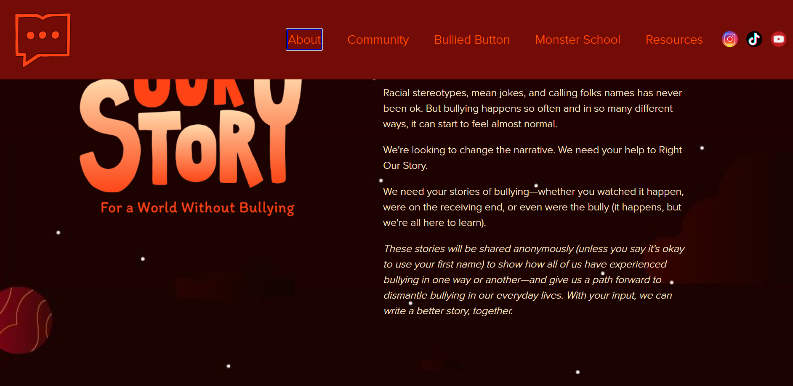

  - Focus state van de img links verbeteren
  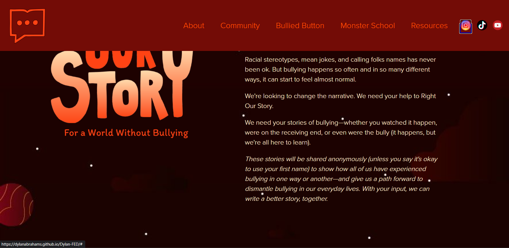

## Herkansing veranderingen

  ### Stand van zaken
  - Focus state is veranderd
  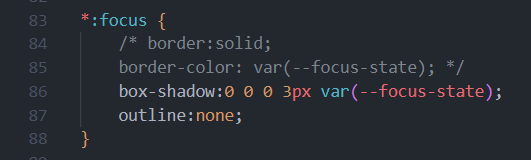
  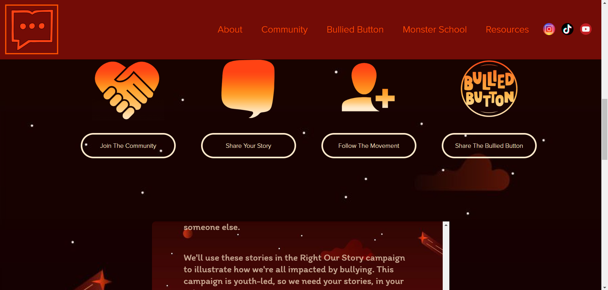

  - Ik heb de code van de homepagina veranderd. De eerste div met article is nu een section met een div erin, de h1 staat nu ook bovenaan

    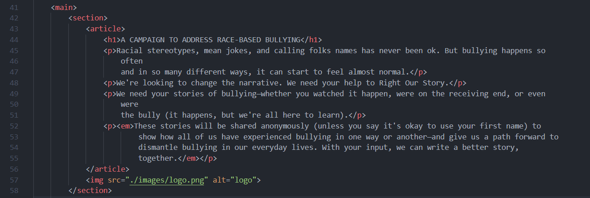
    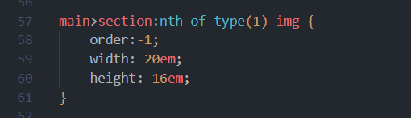

  - De tweede div is nu section:nth-of-type(3) en het is iets meer uitgewerkt. De start knop wordt niet meer meegescrollt. 

    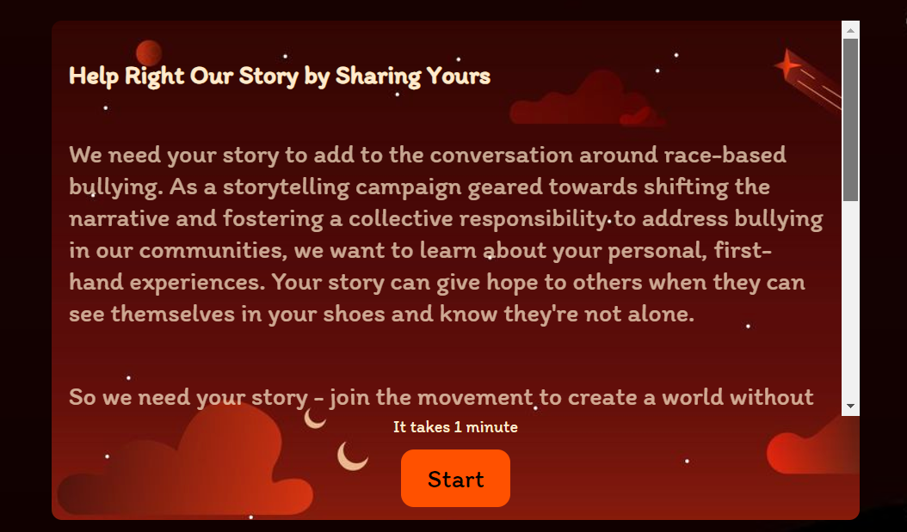
    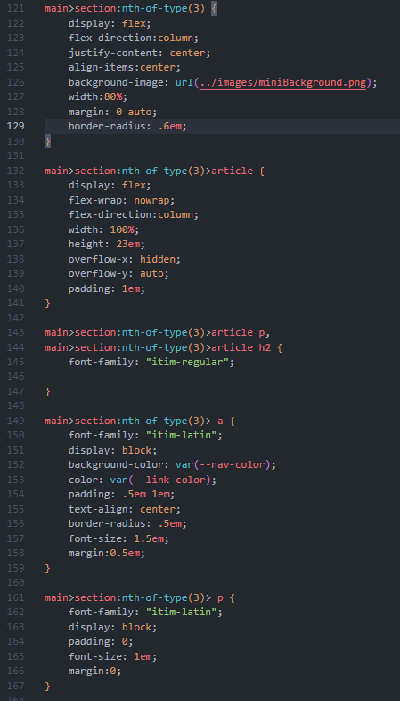

  - Wat eerst section:nth-of-type(1) was is nu nth-of-type(2) en wat eerst section:nth-of-type(2) was is nu section:nth-of-type(4)

  - De 4e section heeft een onzichtbare h2 die gelezen kan worden door de screenreader
  
  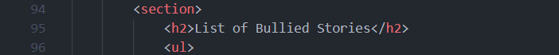
  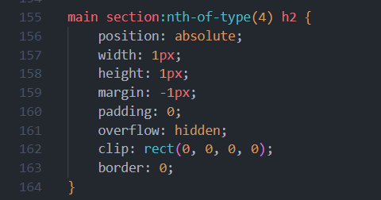

## Bronnenlijst

  
continu bijhouden terwijl je werkt

  Nb. Wees specifiek ('css-tricks' als bron is bijv. niet specifiek genoeg). 
  Nb. ChatGpT en andere AI horen er ook bij.
  Nb. Vermeld de bronnen ook in je code.

  1. ChatGPT
  2. W3Schools
  3. 

